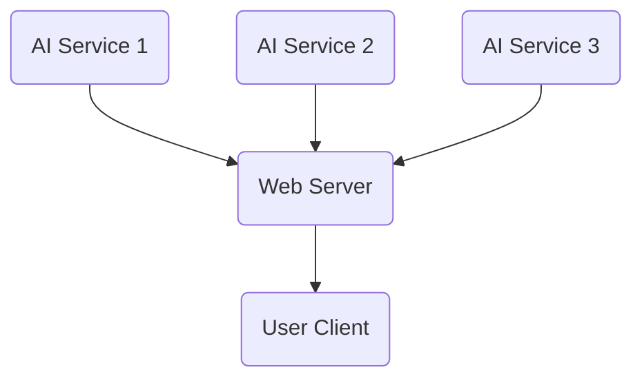

# pettodex-ai-ml-models

This repository contains the servers for the AI/ML models used for the Pettodex project.

Each folder contains a server for running an AI service that the Pettodex backend can subscribe to.

## Priority
For now, our priority is to create the API for the visual model. After that, we'll need to pick out a publicly-available pre-trained model to use for the service.

If there's enough time after this, we could try training our own model from scratch, probably while using a publicly-available dataset.
